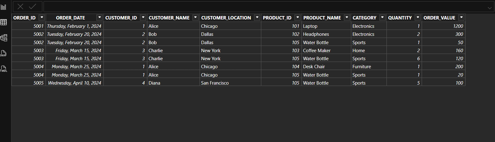
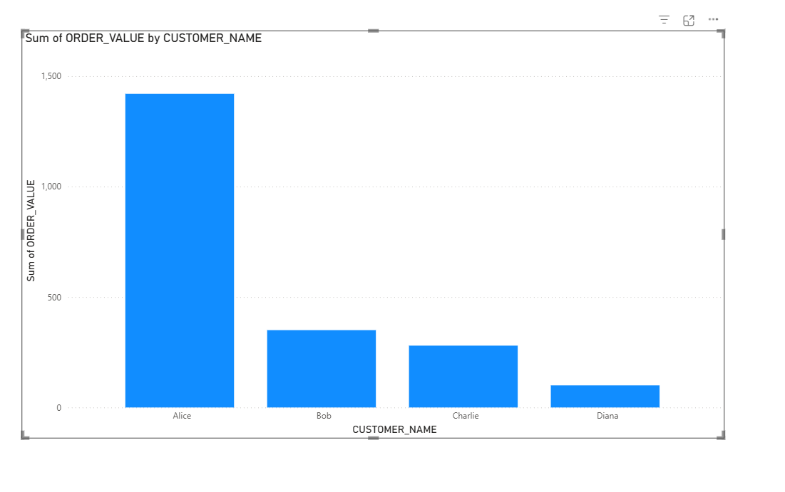
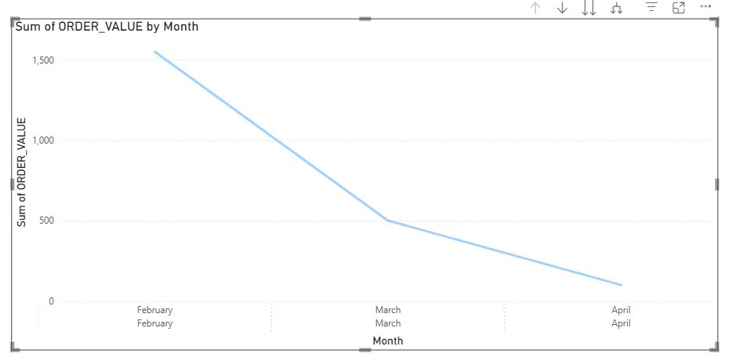
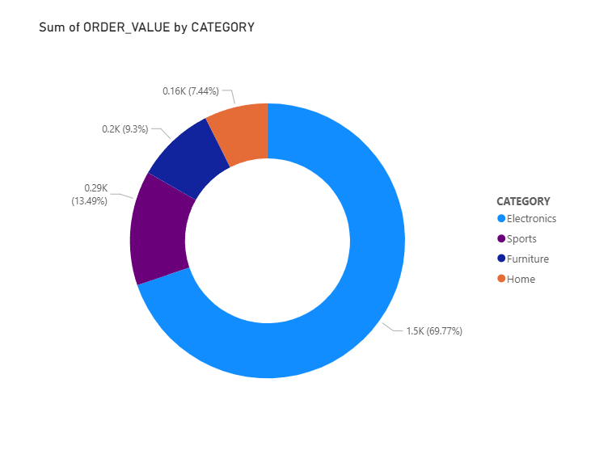
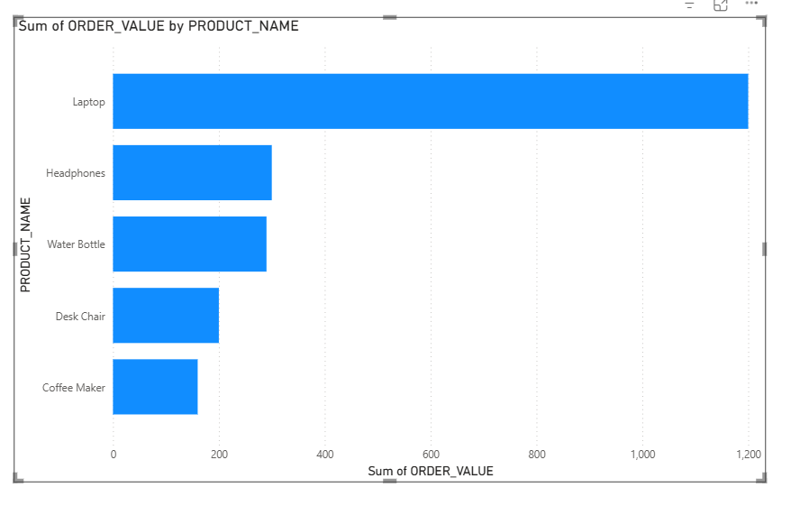
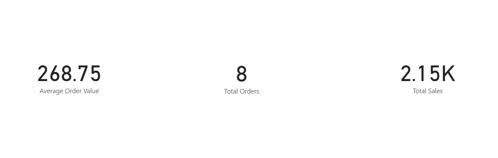

# Snowflake + Power BI Analytics

This project demonstrates an **end-to-end analytics pipeline** using **Snowflake (SQL for data modeling)** and **Power BI (dashboard visualization)**.  

It starts from raw CSV files → loads data into Snowflake with SQL scripts → builds an analytics view → connects Power BI to create a dashboard.

---

## 📂 Project Structure

```text
snowflake-powerbi-analytics/
├── data/                # Raw CSV datasets
│   ├── customers.csv
│   ├── products.csv
│   ├── orders.csv
│   └── order_items.csv
├── sql/                 # Snowflake SQL scripts
│   ├── 01_create_tables.sql
│   ├── 02_load_data.sql
│   └── 03_create_view.sql
└── dashboard/           # Power BI screenshots
    └── screenshots/
        ├── 01-data-preview.png
        ├── 02-sales-by-customer.png
        ├── 03-sales-trend.png
        ├── 04-category-breakdown.png
        ├── 05-top-products.png
        ├── 06-kpi-cards.png
        └── 07-dashboard.png

---

## 🚀 Workflow

### 1. Data Preparation (SQL in Snowflake)
- **`01_create_tables.sql`** → Creates Snowflake tables (`customers`, `products`, `orders`, `order_items`).  
- **`02_load_data.sql`** → Loads the CSV files into Snowflake tables.  
- **`03_create_view.sql`** → Builds an aggregated analytics view for reporting.  

### 2. Data Visualization (Power BI)
- Connect Power BI to the Snowflake view.  
- Build key metrics and visuals:  
  - Total Sales  
  - Total Orders  
  - Average Order Value  
  - Sales by Customer  
  - Sales Trend (by Month)  
  - Category Breakdown  
  - Top Products  
- Combine everything into a final dashboard.  

---

## 📊 Dashboard Screenshots

### Data Preview


### Sales by Customer


### Sales Trend


### Category Breakdown


### Top Products


### KPI Cards


### Final Dashboard


---

## ✅ Key Skills Demonstrated
- **SQL & Data Modeling** in Snowflake  
- **ETL pipeline**: loading raw CSVs into structured tables  
- **Business Intelligence** with Power BI  
- **Dashboard storytelling**: KPIs + trends + category/product breakdowns  

---

## 📌 Future Improvements
- Add customer segmentation analysis  
- Create automated refresh pipelines  
- Explore time-series forecasting with Power BI  

---

👨‍💻 Built by *William Kim* — showcasing SQL + BI integration.